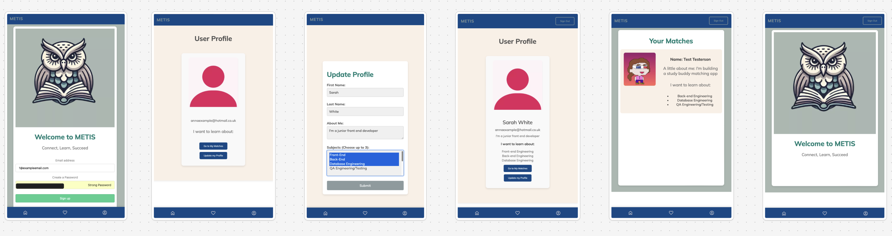

<h1> 👋 Hi, I’m Elspeth - I'm a Full Stack Developer </h1>

I became interested in tech after paralegalling in a legal tech startup, and did some short coding courses outside of work in Python & SQL. I noticed how diversity is a big problem in the tech industry, and later joined Code First Girls, where I worked as a Senior Programmes Coordinator and organised online coding classes for women and non-binary people. I decided to use my passion for inclusive tech and creative problem solving with code to become a developer, and was accepted onto the School of Code’s BC17 bootcamp in 2024

- 🌍 Based in London, UK
- 📚 Since graduating in October 2024 I’ve been honing my skills in full-stack engineering. I’m currently working on a restaurant review app
- ✉️ Eager to apply my technical skills and interests in a Junior Full Stack Developer / Software Engineer role. Contact me via Linkedin

### **Tech Stack**

 
 
 
 
 
 
 
 
 
 
 
 

### **I'm currently learning**

<h1> 🚀 Projects </h1>

### **🧠 Metis - Study Buddy Matching App**

**Description**: Metis is a mobile responsive study app to help students connect with study partners. I completed this as part of the School of Code final assessment in a team of five. We had 5 days to conduct user research, plan, build and present our app to fellow bootcampers, SoC coaches and mentors, and tech industry members. Our app is ‘Metis’, named after the Greek goddess of wisdom. Metis includes authentication, profile creation, database creation & the app has the ability to generate a list of user profiles, excluding the user's own profile

**Tech Stack**: React.js / Next.js, CSS, Supabase, Render, Github

**Key contributions:** 
- Conducted competitor research and user research analysis
- Created Next.js components for user profile card and full users list
- Created design theme and selected font, RGB colour codes and app logo based on colour theory

### **🍔 London Bytes - Restaurant Review App**

**Description**: London Bytes is a restaurant review app showing my favourite spots for food in London. I started this ongoing project to combine my love of food and tech, and to practice my front-end skills and learn how to use Tailwind

**Tech Stack**: tbh 
